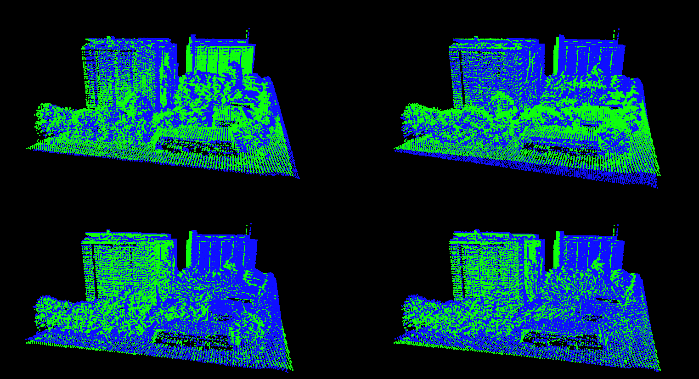
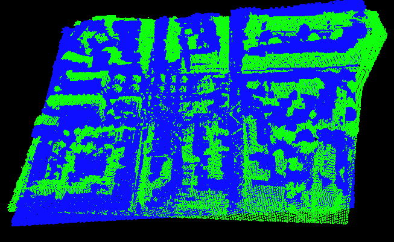

# Master Project 2019

### Introduction

This is my master project on automated geographical alignment procedure through dense point cloud simplification. Current state of the art algorithms do perform well when aligning relatively simple point clouds. However when the number of points and the complexity of clouds increases, existing algorithms tend to get stuck in local minimas and never find the optimal solution. This is due to the fact that the number of points and topological of the cloud becomes too complex and the number of keypoints involved to optimize the cost function is to high for it to make sense, hence the erratic results.

In order to solve this problem, the idea explored in this project is to perform the registration on a simplification of the original source and target objects. The type of clouds at my disposal during this project was ones of Geneva's city, recorded by aerial view using a LIDAR technology. It is mainly formed by planar surfaces representing the roofs and walls of the city's buildings, as well as the roads. For this reason, the simplification choosed was to segment the point clouds of both the source and target clouds in planes. These formed two sets of segmented planes, each defined by their plane's center coordinates, their normal vector and the points belonging to each of them. The registration algorithm is then performed using these two sets of planes, that are extremely simplified, rather than the original clouds.

### Research summary

The first step of the project was to find and test automated state-of-the-art registration algorithms. The algorithms tested are RANSAC, 4PCS and KFPCS. The tests showed that these alogirthms worked well for simple clouds, but the registration obtained on our test set were not precise, hence the need for a more adapted algorithm.

The first step was to implement the simplification process. A plane segmentation algorithm was chosen because it was adapted to the kind of point clouds available. This algorithm works by region growing, which means that it will choose a point in the cloud and look for neighboring points. If this first set of points represent a planar surface, the algorithm will iteratively expand the set of points by adding new neighboring points that belong to the plane. A plane is completely segmented when no new points can be found. This process is repeated until every plane is segmented, on both the source and target clouds. A similar process is used when segmenting meshes.

The plane segmentation result is a set of planes that covers the entire cloud, without the points that have been excluded because detected as on a non planar surface.  However, it can happen during the region growing steps that the plane computed is not perfectly aligned with the real surface represented by the points. Thus, when the region grows, new points can be slightly out of range to be considered as belonging in the plane. This has for effect that some big surfaces are segmented in multiple planes. To solve this problem, a last phase was added to the cloud segmentation process: Plane Merging. This step will simply try to merge segmented planes that are on the same large planar surface together by comparing their normal vector and checking if they overlap.

The next step is the registration itself. Which must be able to align point clouds and meshes into one another. This is achieved by taking as input a set of planes that must be aligned called the source, and another set of planes that is the target of the alignment. These sets of planes are defined the same way for point clouds and meshes. This phase is divided in three parts. First, plane pairs are selected, then the transformation is decomposed in a rotation and a translation. The plane pair selection is done by computing a point feature historgram for both set of planes, using the each plane's centroid as points, associated with the plane's normal vector. Planes that have the most similar histograms are associated together to form a pair. The rotation matrix has to rotate the set of source plane's centers to match their corresponding target planes' centers. And lastly, the translation has to snap in place the rotated set of source planes'centers into the target set.

Here are a few examples of the results obtained with this algorithm, 

1. Successfull alignment results.

2. Unsuccessfull alignment result.

### Installation and Usage
- CMAKE version 3.6.2 or greater is required to install this software.
- Dependencies: The code has been developped on Linux Mint. The external libraries to install are:
	- Point Cloud Library 1.9 (PCL)
	- OpenMP
	- OpenCV
- After that, open a console in the root directory of this project and execute the following commands:
	- mkdir build
	- cd build
	- cmake ..
	- make
- Once the installation is finished, the software can be launched with the command: ./PointCloudAlignment [c/m] source_file [c/m] target_file
With [c/m] being either c or m whether the following file contains a point cloud or a mesh.
- If the two file provided are correctly formated, both objects should appear on the screen.
- The commands to segment and register the clouds/meshes are then as follows:
	1. Cloud/Mesh segmentation:
		- Resample cloud: **F10**
		- Preprocess cloud (to compute the curvature values and normal vectors): **F9**
		- Filter out points with high curvature: **F8**
		- Start plane segmentation for point clouds: **l**
		- Start plane segmentation for meshes: **F5**
		- After segmentation, merge similar planes of the cloud: **F11**
	2. Registration: After both clouds/meshes have been preprocessed and segmented, align the source on the target with key: **a**
	3. Miscellaneous keys:
		- Reset cloud color: **F1**
		- Display cloud curvature: **F2**
		- Display cloud computed k-neighborhood: **F3**
		- Display cloud normal vectors: **F4**
		- Save point clouds in files __mySourcePC.ply__ and __myTargetPC.ply__: **F6**
		- Display source cloud in red and target cloud in green: **F7**
		- After registration, cycle through associated planes and highlight them: **k**

### License

Automated geographical alignment procedure through dense point clouds simplification - Loris Aiulfi
Copyright (c) 2019 EPFL
This program is licensed under the terms of the GPL.
